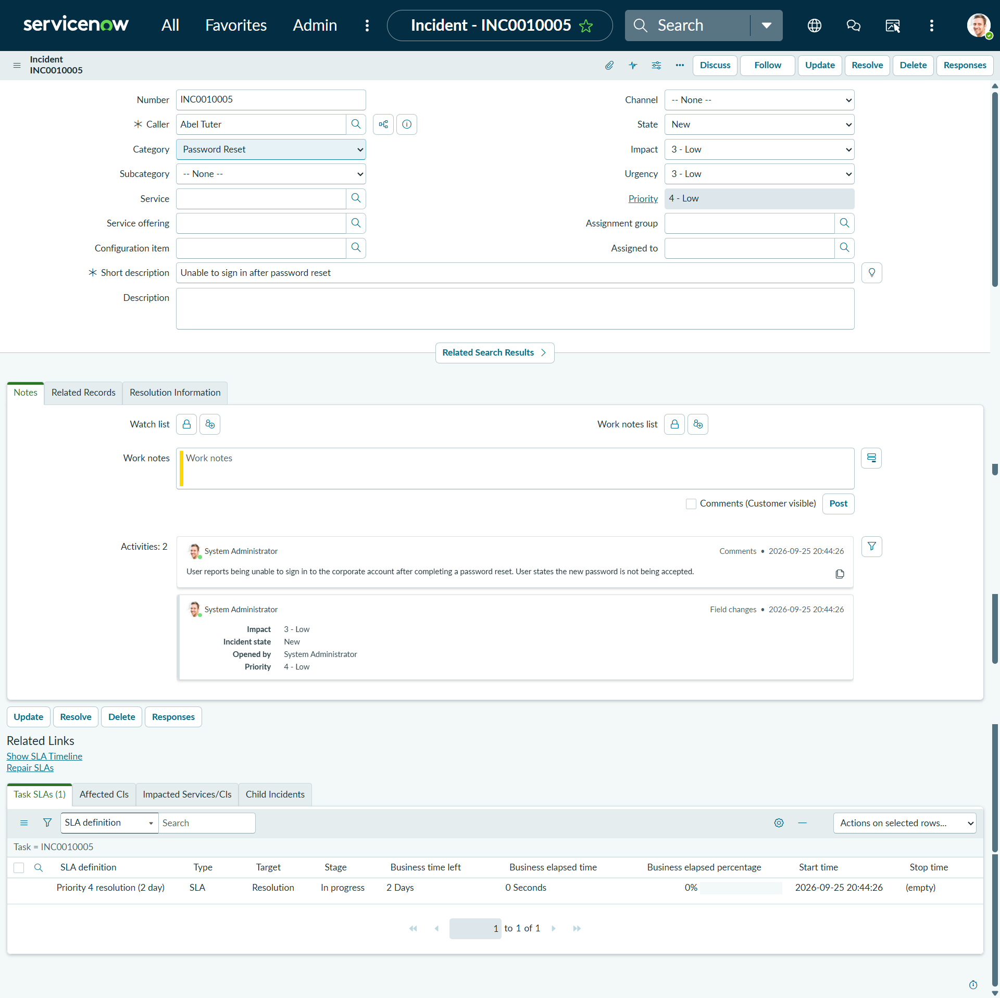
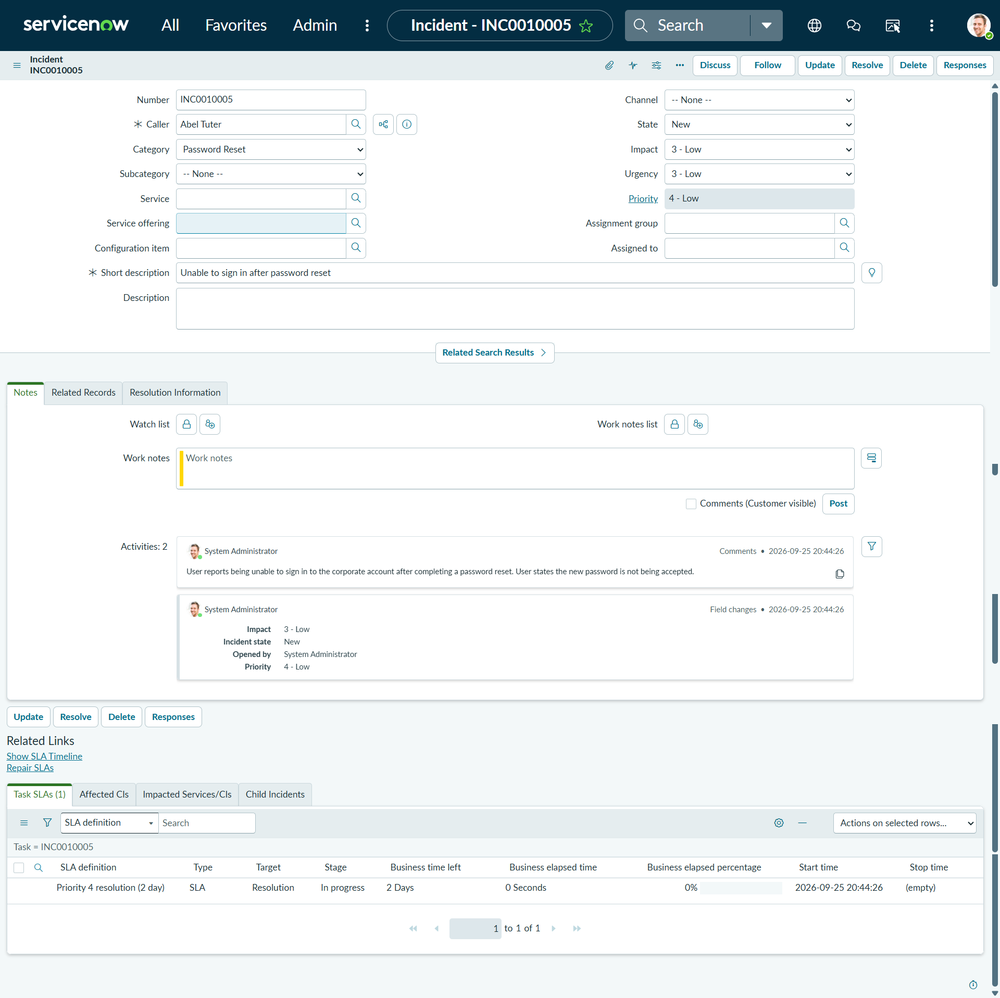
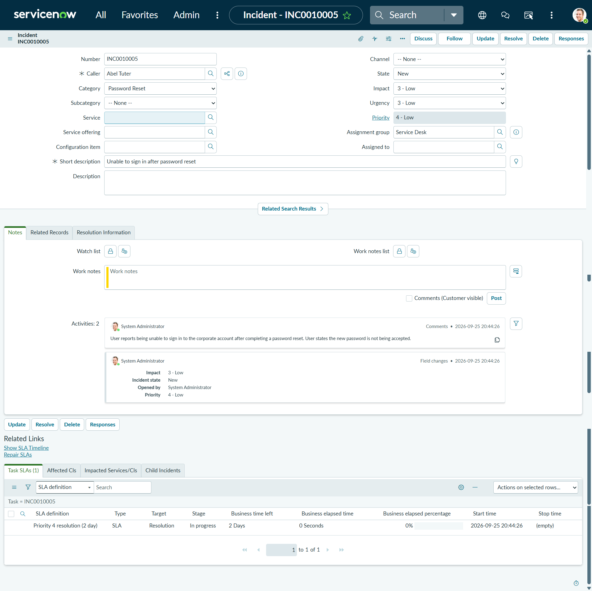
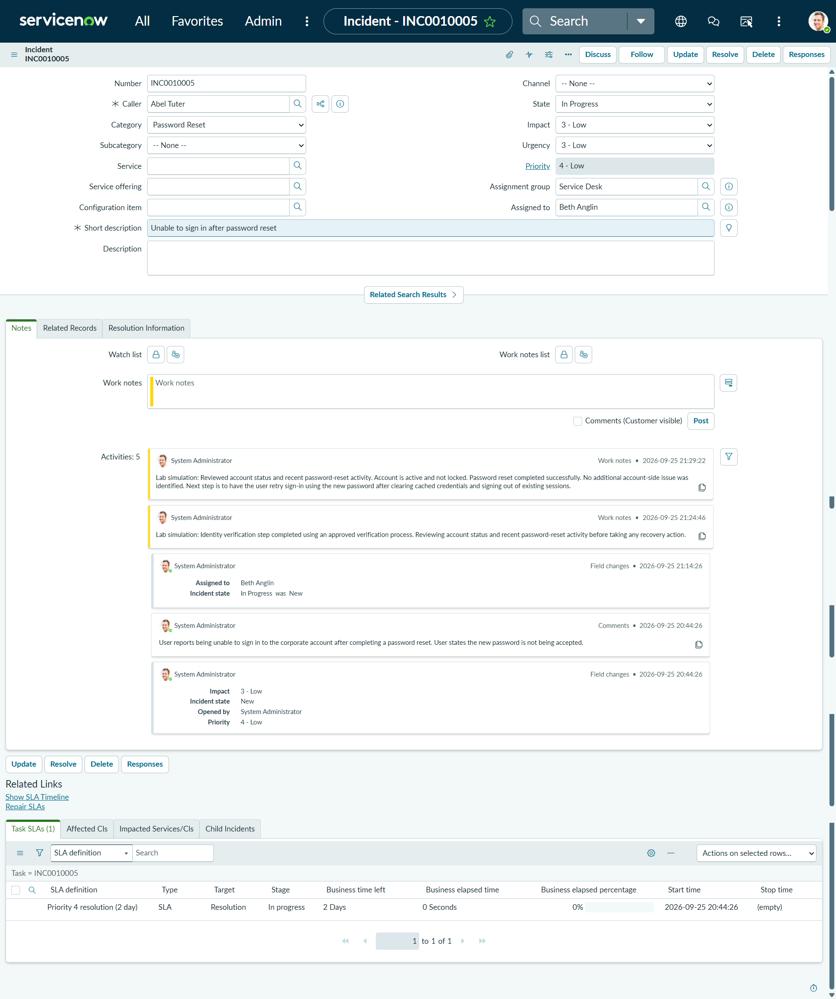
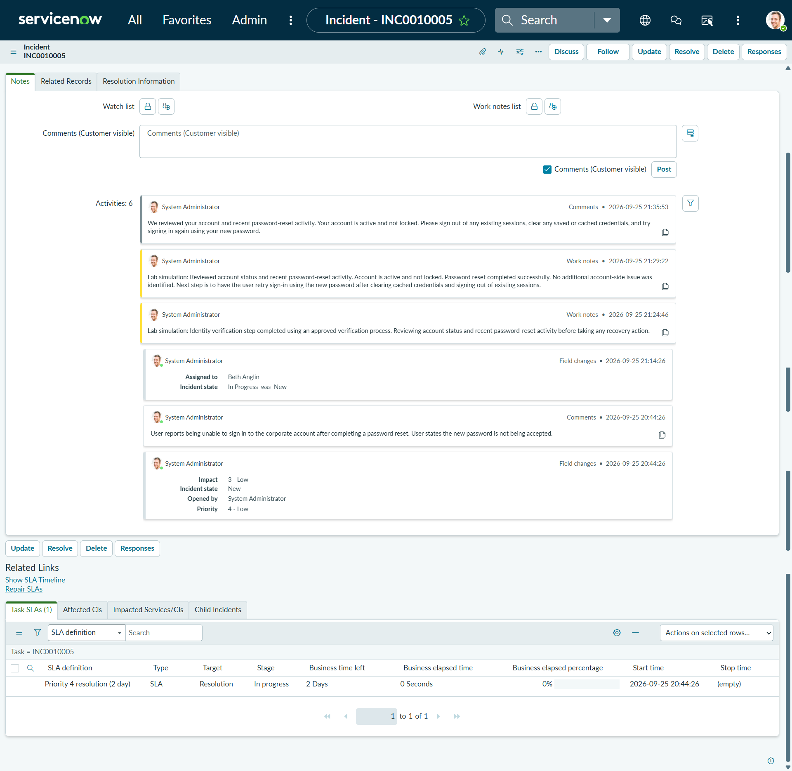
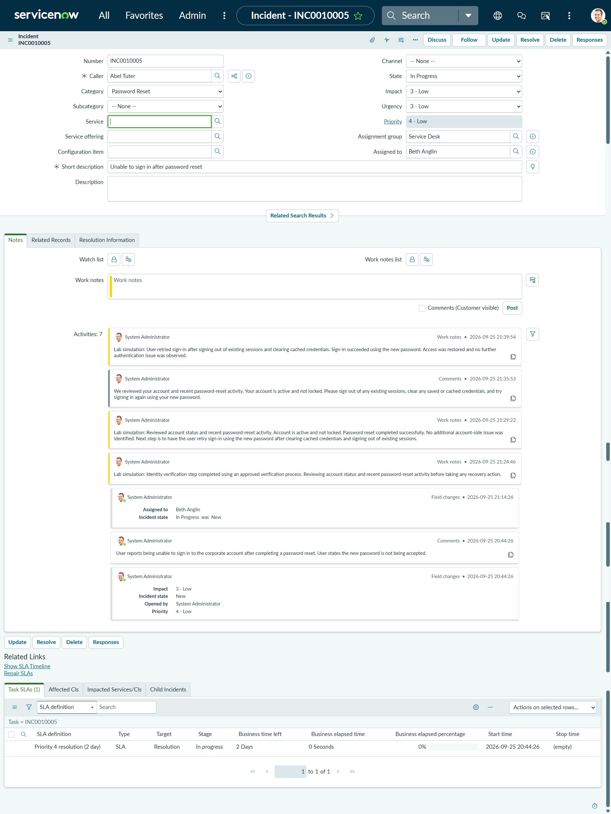
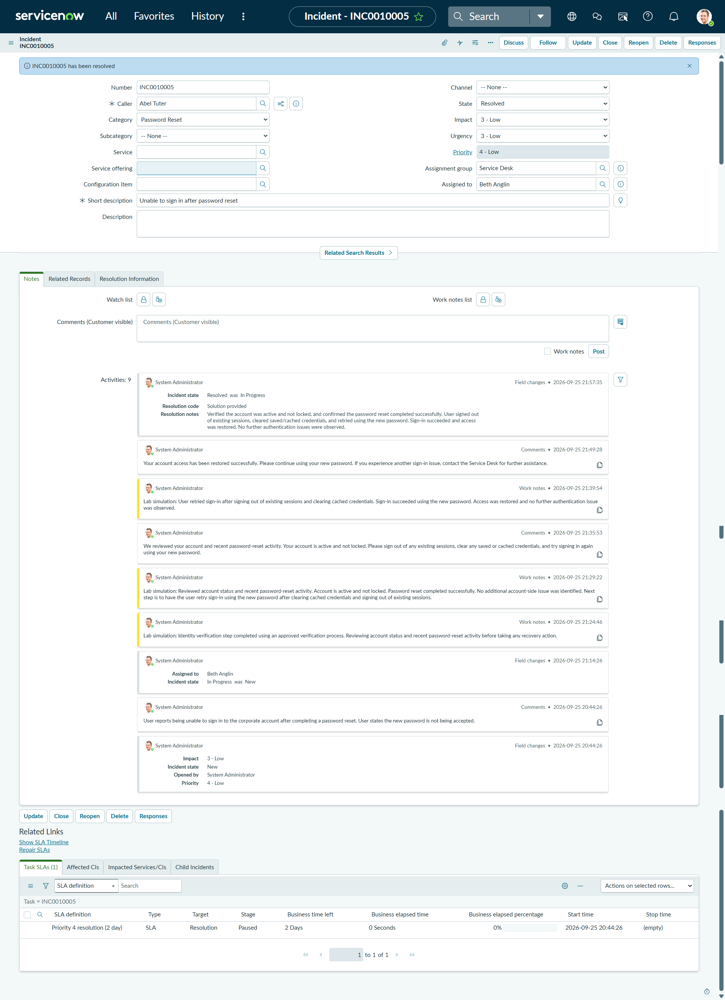
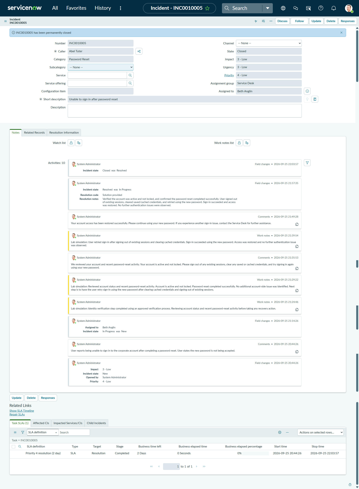

# ServiceNow IAM Service Desk Incident Lab

Hands-on ServiceNow IAM / ITSM lab demonstrating authentication-incident intake, triage, classification, routing, identity and account validation, troubleshooting, customer communication, SLA tracking, resolution, and ticket closure.

> **Lab environment:** This project was completed in a ServiceNow Personal Developer Instance (PDI) using sample/test data. No production systems or real user accounts were involved.

## Project Objectives

- Create and manage a realistic authentication-related ServiceNow incident
- Document the affected user and reported sign-in issue
- Classify and route the incident through the Service Desk
- Demonstrate a simulated identity-verification checkpoint before account recovery activity
- Review account state and recent password-reset activity
- Document internal analyst investigation using Work Notes
- Communicate troubleshooting instructions through customer-visible Comments
- Verify successful restoration of sign-in access
- Record a clear resolution and complete the incident lifecycle
- Observe SLA status throughout the ticket workflow

## Environment

- ServiceNow Personal Developer Instance
- ServiceNow Incident Management
- Sample user: Abel Tuter
- Assignment group: Service Desk
- Incident: `INC0010005`
- Category: Password Reset
- Priority: 4 - Low

## Scenario

A sample user reported being unable to sign in to a corporate account after completing a password reset.

The objective was to simulate how a Service Desk or IAM analyst could receive the issue, document it, classify and route the incident, perform identity/account validation, provide troubleshooting guidance, verify successful sign-in restoration, and complete the ticket lifecycle.

The exact root cause was not conclusively established.

The verified result was that the account was active and not locked, the password reset had completed successfully, and sign-in succeeded after the user signed out of existing sessions, cleared saved or cached credentials, and retried using the new password.

## Incident Workflow

### 1. Authentication Incident Created

A new ServiceNow Incident was created for the sample user with the short description:

**Unable to sign in after password reset**

The initial customer-visible report documented that the new password was not being accepted.

---

### 2. Incident Classified

The incident was classified under **Password Reset** based on the available ServiceNow categories.

This helped organize the issue around the appropriate authentication-support area.

---

### 3. Incident Routed to the Service Desk

The incident was routed to the **Service Desk** and moved from **New** to **In Progress**.

This represented the point where an analyst took ownership of the issue and began active troubleshooting.

---

### 4. Identity and Account Investigation Documented

Internal Work Notes were used to document the lab investigation.

The workflow included a simulated identity-verification checkpoint before reviewing the account state and password-reset activity.

The account was confirmed as active and not locked, and the password reset was recorded as successfully completed.

---

### 5. Customer Troubleshooting Guidance Provided

A customer-visible update instructed the user to:

- Sign out of existing sessions
- Clear saved or cached credentials
- Retry sign-in using the new password

This demonstrated the difference between internal analyst Work Notes and customer-facing Comments.

---

### 6. Sign-In Restoration Verified

The lab scenario recorded that the user retried sign-in after clearing existing sessions and cached credentials.

Sign-in succeeded using the new password, access was restored, and no further authentication issue was observed.

---

### 7. Resolution and Activity Trail Verified

The incident was resolved with the resolution code:

**Solution provided**

Resolution notes documented the validated account state, troubleshooting steps, successful sign-in, and restored access.

The ServiceNow Activity stream preserved the analyst notes, customer-visible communication, state changes, and resolution information.

---

### 8. Incident Closed

After successful resolution, the incident was permanently closed.

The final ServiceNow record showed the lifecycle transition from:

`New → In Progress → Resolved → Closed`

The related SLA record also reached the **Completed** stage.

## Key IAM and ITSM Concepts Demonstrated

| Concept | Demonstration |
|---|---|
| Incident Management | Managed an authentication issue from intake through closure |
| Triage | Reviewed the issue before taking recovery action |
| Identity Verification | Simulated an identity-verification checkpoint before account recovery |
| Authentication Support | Investigated a sign-in problem following a password reset |
| Account Validation | Reviewed whether the account was active or locked |
| Ticket Classification | Classified the incident under Password Reset |
| Assignment & Routing | Routed the incident to the Service Desk |
| Work Notes | Documented internal analyst investigation |
| Customer Comments | Provided customer-visible troubleshooting guidance |
| Verification | Confirmed successful sign-in before resolution |
| Resolution Management | Recorded a resolution code and detailed resolution notes |
| SLA Tracking | Observed the ServiceNow SLA lifecycle |
| Auditability | Maintained an activity trail of ticket actions and state changes |

## Work Notes vs. Customer Comments

**Work Notes** were used for internal analyst documentation, including identity/account validation and troubleshooting observations.

**Comments** were used for information intended for the customer, including troubleshooting instructions and confirmation that access had been restored.

This separation supports clear communication while preserving an internal operational record.

## Incident Lifecycle

`Report → Triage → Classify → Route → Investigate → Communicate → Verify → Resolve → Close`

The incident was not considered complete simply because access appeared to work.

The result was verified, documented, communicated to the user, resolved, and then closed.

## Key Takeaway

Effective IAM and Service Desk operations require more than performing a password reset.

A structured workflow includes validating the user and account context, documenting investigation steps, communicating clearly with the customer, verifying that authentication has been restored, recording the resolution, and maintaining an auditable ticket history.

This lab demonstrates how ServiceNow can provide the operational workflow and documentation layer around identity and authentication support activities.
